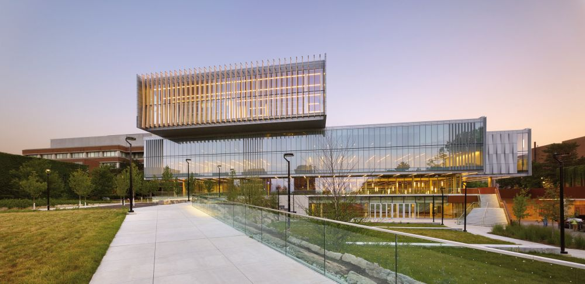

The conference venue is the <a href="https://youtu.be/enMcHisqOnc?si=ConM0H4mmWAy2gfH">Second Student Centre (SCC)</a> on the <a href="https://maps.app.goo.gl/kYmUzwPSLyVfnvio9"> Keele Campus of York University</a> located at 15 Library Lane, M3J-1P3, Toronto, Canada. 

CASCON attendees are expected to behave in accordance with the <a href="https://www.ieee.org/about/corporate/governance/p7-8.html">IEEE Code of Ethics</a>.

{}
Registration
{.h1}

<a href="https://cscan-infocan.ca/co-located-tickets/">Registration Site for CASCON 2024</a>

<ul>
  <li>You can register for one day, two days, or a Full Pass for the whole conference.</li>
  <li>In the day that you are registered, you may attend any of the co-located events.</li>
  <li>Authors of CASCON 2024 papers must register for a Full Pass</li>
  <li>People that require a visa letter must register for a Full Pass</li>
</ul>
